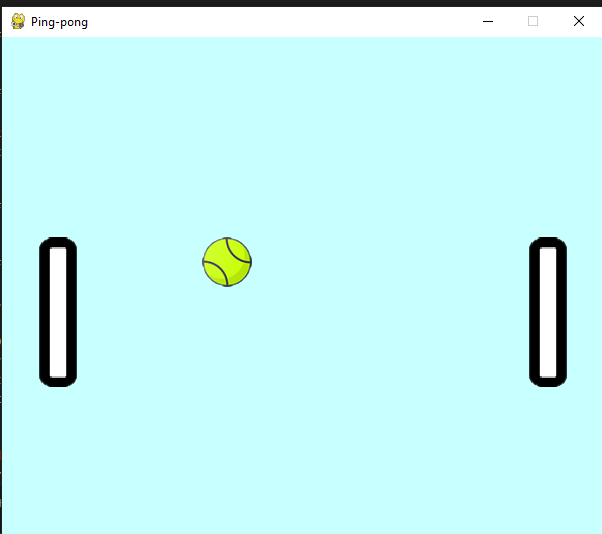

# Ping-pong

Ping-pong - это игра, разработанная на pygame, в которую вы играете вдвоём. Первый игрок управляет ракеткой слева с помощью клавиш W и S. Второй игрок управляет ракеткой с помощью стрелочек вверх и вниз.
